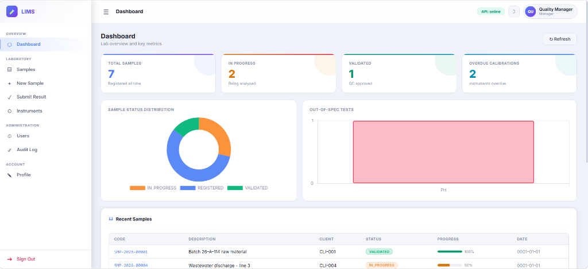
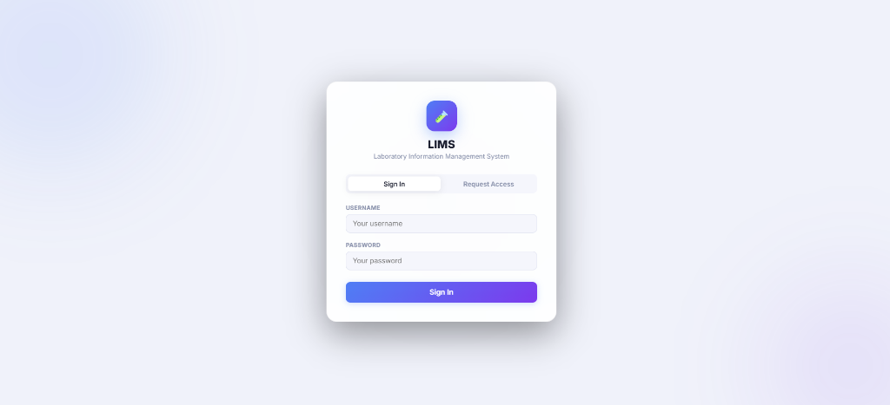

# LIMS — Laboratory Information Management System

A production-style **LIMS** managing the complete lifecycle of laboratory
samples — registration, analysis, results, validation and reporting:

> C# / .NET 10 · ASP.NET Core REST API & Built-in SPA Dashboard ·
> SQL Server (T-SQL, views, stored procedures, SSIS, SSRS) ·
> Web Services REST & SOAP 1.1 · Windows Services · VB Script ·
> JWT authentication & role-based authorization ·
> Unit tests · Azure DevOps CI · Crystal Reports

## What the application does

The LIMS manages the **full lifecycle of laboratory samples**:

```
REGISTERED ──> IN_PROGRESS ──> COMPLETED ──> VALIDATED
     \                                              /
      +--------> REJECTED / CANCELLED <------------+
```

- **Interactive SPA Web Dashboard**: Modern responsive UI with dark/light glassmorphic design, real-time KPI metrics, and Chart.js analytics.
- **Sample registration** with automatic code generation (`SMP-2026-00042`) and client metadata.
- **Test catalogue** (pH, HPLC assay, Karl Fischer, etc.) with strict specification limits.
- **Result capture** with automatic pass/fail evaluation against analytical specs.
- **Instrument middleware**: CSV result files from lab analysers imported automatically (Windows Service / VB Script / SSIS).
- **Instrument calibration tracker**: Real-time calibration status and overdue alerts.
- **Full regulatory Audit Trail**: Searchable, filterable 21 CFR Part 11 compliant audit log across all subsystems.
- **Authentication & roles**: JWT login with token revocation & versioning — `Analyst` submits results, `Manager` validates/rejects samples and manages users.
- **Reporting**: SSRS dashboards + Crystal Reports Certificates of Analysis.
- **System integration**: REST API + SOAP 1.1 service (ERP/MES interop).

## Screenshots & User Interface

### 📊 Lab Overview & Quality Manager Dashboard
*Real-time sample status distribution, out-of-spec test monitoring, calibration alerts, and recent worklists:*


### 🔐 Secure JWT Authentication & Access Request
*Role-based sign-in with token versioning and session persistence:*


### 🧪 Analyst Workspace
*Role-scoped navigation tailored for lab analysts submitting analytical test results:*


## Repository layout

```
LimsPortfolio/
├── LimsPortfolio.sln                 # Visual Studio 2022 solution (.NET 10)
├── azure-pipelines.yml               # Azure DevOps CI (build + tests + artifacts)
├── src/
│   ├── Lims.Core/                    # Domain: models, workflow rules, interfaces
│   ├── Lims.Infrastructure/          # Dapper repositories -> stored procedures
│   ├── Lims.RestApi/                 # REST API & SPA Dashboard (wwwroot, Swagger)
│   ├── Lims.SoapService/             # SOAP 1.1 endpoint (WSDL, faults)
│   └── Lims.WindowsService/          # Windows Service: instrument file import
├── tests/Lims.Tests/                 # xUnit unit & integration tests
├── database/
│   ├── 01_tables.sql                 # Schema: samples, tests, results, audit...
│   ├── 02_views.sql                  # Business and reporting views
│   ├── 03_stored_procedures.sql      # Core stored procedures (workflow + auth)
│   ├── 04_seed_data.sql              # Reference/seed data (clients, instruments, samples)
│   ├── 05_token_revocation.sql       # JWT token revocation and security stamp tables
│   ├── 06_additional_procedures.sql  # Audit trail querying and client list procedures
│   ├── run-all.ps1                   # Automated database setup script
│   ├── ssis/                         # SSIS package design + staging/MERGE logic
│   └── ssrs/                         # SSRS reports (SampleSummaryReport.rdl)
├── scripts/vbs/                      # VB Script middleware (ADO import, Excel export)
├── reports/crystal/                  # Crystal Reports (CoA) design & integration
└── docs/                             # Architecture, setup guides, and UI screenshots
```

## Quick start

```bash
# 1) Database (SQL Server LocalDB / Express)
# Execute all scripts in database/ or run:
powershell -ExecutionPolicy Bypass -File database/run-all.ps1

# 2) REST API & Web UI  -> http://localhost:5000
cd src/Lims.RestApi && dotnet run
# Open http://localhost:5000 in your browser to access the Web UI,
# or http://localhost:5000/swagger for the interactive Swagger documentation.

# 3) SOAP service -> http://localhost:5002/LimsSampleService.asmx?wsdl
cd src/Lims.SoapService && dotnet run

# 4) Unit & Integration tests
dotnet test LimsPortfolio.sln
```

Full instructions: [`docs/GETTING_STARTED.md`](docs/GETTING_STARTED.md) ·
Architecture: [`docs/ARCHITECTURE.md`](docs/ARCHITECTURE.md)

## API examples

**REST**

```http
POST /api/auth/login
{ "username": "analyst1", "password": "Analyst@2026" }
-> { "token": "eyJ...", "role": "Analyst", "expiresAtUtc": "..." }

POST /api/samples
Authorization: Bearer <token>
{ "clientCode": "CLI-001", "matrix": "Water", "testCodes": ["PH","ASSAY"] }

POST /api/samples/SMP-2026-00001/results
Authorization: Bearer <token>
{ "testCode": "PH", "resultValue": 7.12, "instrumentCode": "PHM-01" }

PUT  /api/samples/SMP-2026-00001/status            # Manager role required
Authorization: Bearer <manager-token>
{ "newStatus": "VALIDATED", "comment": "Reviewed by lab manager" }
```

**SOAP 1.1** (legacy ERP interop)

```xml
<soap:Envelope xmlns:soap="http://schemas.xmlsoap.org/soap/envelope/">
  <soap:Body>
    <SubmitResult>
      <sampleCode>SMP-2026-00001</sampleCode>
      <testCode>ASSAY</testCode>
      <resultValue>99.4</resultValue>
      <instrumentCode>HPLC-01</instrumentCode>
    </SubmitResult>
  </soap:Body>
</soap:Envelope>
```

## Solution map

| Concern                    | Location                                                          |
|----------------------------|-------------------------------------------------------------------|
| Domain & business rules    | `src/Lims.Core` — models, workflow rules, interfaces              |
| Persistence                | `src/Lims.Infrastructure` — Dapper over stored procedures          |
| REST API                   | `src/Lims.RestApi` — controllers, Swagger, error middleware       |
| Authentication             | `AuthController` + `JwtTokenService` — JWT bearer, roles Analyst/Manager |
| SOAP 1.1 service           | `src/Lims.SoapService` — WSDL, faults                             |
| Windows Service            | `src/Lims.WindowsService` — instrument file import                |
| Unit tests                 | `tests/Lims.Tests` — parser + business rules (xUnit)              |
| Build / CI                 | `azure-pipelines.yml` — build, tests, coverage, artifacts         |
| Reporting                  | `database/ssrs/` and `reports/crystal/` — SSRS + Crystal Reports  |

## Default accounts

| Username       | Password        | Role    | Can do                                        |
|----------------|-----------------|---------|-----------------------------------------------|
| `analyst1`     | `Analyst@2026`  | Analyst | Register samples, submit results              |
| `analyst2`     | `Analyst@2026`  | Analyst | Register samples, submit results              |
| `qual.manager` | `Manager@2026`  | Manager | Everything above + validate / reject samples  |

Passwords are stored in `dbo.Users` as PBKDF2-SHA256 hashes
(100 000 iterations, per-user salt) — see `Lims.Core/Services/PasswordHasher.cs`.

## Reference data

The seed script creates 4 clients, 5 instruments (one calibration overdue),
5 analytical methods, 3 lab accounts and 5 samples — including one
**out-of-spec result** and one **validated sample** — so every screen, report
and endpoint has data.